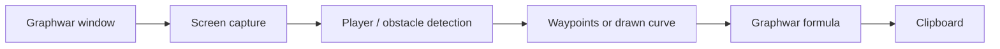
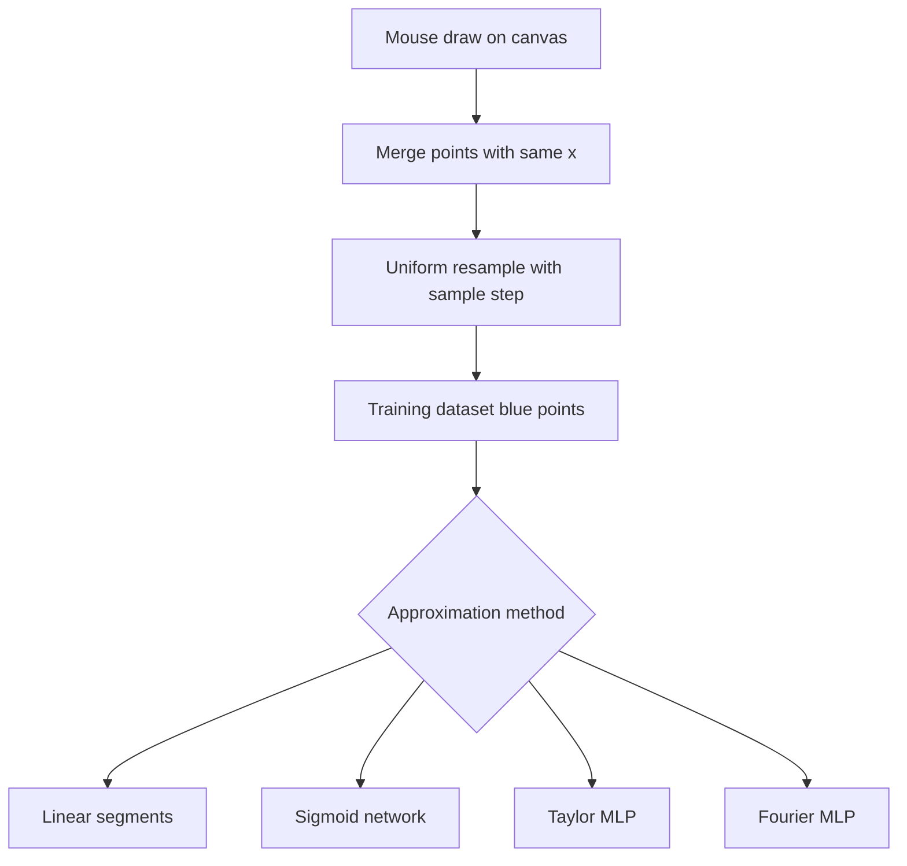

# GraphBot

> A passion project for [Graphwar](https://github.com/catabriga/graphwar) — turn what you see on the battlefield into a paste-ready mathematical function.

GraphBot watches the game field and builds Graphwar-compatible formulas. The **recommended workflow** is the local **web UI** (`approximator_server.py`) — **Click mode** (default) and **Draw mode** with four approximation methods. **`GraphBot.py`** still offers click mode (OpenCV overlay) and an **automatic mode** prototype that is **not production-ready yet**.

> **Project status:** web UI (click + draw) = ready to use · `GraphBot.py` auto mode = work in progress (see [Auto mode](#auto-mode-work-in-progress))

> **How GraphBot touches Graphwar:** GraphBot is an **external helper** — it does **not** modify game files, inject into the game process, read game memory, or automate gameplay. The only direct interaction with the Graphwar window is **moving it to a fixed corner** so screen capture aligns with the configured field region. Everything else is: screenshot → math → copy a formula to your clipboard. **You** paste it into Graphwar yourself.

https://github.com/user-attachments/assets/95afd94f-aecd-4682-b958-3359238795a6

<p align="center">
  
</p>

---

## Table of contents

- [What is Graphwar?](#what-is-graphwar)
- [Getting started](#getting-started)
- [Web UI (recommended)](#web-ui-recommended)
- [How GraphBot works](#how-graphbot-works)
  - [External tool only (no game tampering)](#external-tool-only-no-game-tampering)
- [Click mode](#click-mode)
- [Draw mode](#draw-mode)
  - [From stroke to dataset](#from-stroke-to-dataset)
  - [Linear segments (same core as click mode)](#1-linear-segments-same-core-as-click-mode)
  - [Sigmoid network (universal approximation)](#2-sigmoid-network-universal-approximation)
  - [Taylor features (polynomial / beta)](#3-taylor-features-polynomial--beta)
  - [Fourier features (harmonics)](#4-fourier-features-harmonics)
- [Auto mode (work in progress)](#auto-mode-work-in-progress)
- [Project layout](#project-layout)
- [Roadmap](#roadmap)
- [More to come](#more-to-come)
- [Feedback & issues](#feedback--issues)
- [License](#license)

---

## What is Graphwar?

Graphwar is an artillery game on a Cartesian plane. You type a function; the game fires along that curve (with a vertical shift so the shot passes through your soldier). Hit enemies, avoid teammates and black obstacle circles.

GraphBot does not replace the game — it helps you **derive** functions faster. See [`GAME_RULES.md`](GAME_RULES.md) for full Graphwar rules and syntax.

**Field limits (approx.):** `x ∈ [-25, 25]`, `y ∈ [-15, 15]`.

---

## Getting started

### Requirements

| Requirement | Notes |
|-------------|-------|
| **Windows** | Screen capture and window APIs are Win32-specific (`pywin32`). |
| **Python 3.10+** | Tested with dependencies in `requirements.txt`. |
| **Graphwar** | Window title must be `Graphwar`. Keep it visible while the bot runs. |

### Install

```powershell
git clone https://github.com/KroSheChKa/GraphBot.git
cd GraphBot
python -m venv .venv
.\.venv\Scripts\Activate.ps1
pip install -r requirements.txt
```

### Run `GraphBot.py` (CLI overlay)

Legacy / alternative entry point — click mode on the live game window with F-keys:

```powershell
python GraphBot.py
```

1. Choose **`1`** (click mode) or **`0`** (auto — experimental).
2. Press **F1** to start, **F2** to quit.
3. In click mode: **F3** start recording clicks, **F4** finish.

See [Click mode → `GraphBot.py`](#graphbotpy-cli) for how formula building differs from the web UI.

**Tip:** If detection looks wrong, tune capture with `python tools/preview_capture.py` and calibration tools under `tools/`.

---

## Web UI (recommended)

The main tool is a local p5.js app served by Python:

```powershell
python tools/approximator_server.py
```

Open **[http://127.0.0.1:8765/](http://127.0.0.1:8765/)** in your browser.

| Mode | What it does |
|------|----------------|
| **1. Click mode** *(default)* | Place waypoints on the canvas; get a piecewise `direct_line` formula |
| **2. Draw mode** | Sketch a curve, resample to a dataset, approximate with 4 methods |

### Shared controls

| Action | Control |
|--------|---------|
| Capture Graphwar field as background | **Захват поля** (Graphwar must be running; window moved to corner for alignment) |
| Clear current path / stroke | **C** *(background screenshot stays)* |
| Copy formula | **Копировать y** |
| Reset sliders & canvas state | **Сброс** |

**After «Захват поля»:** any previous clicks or drawn curve are cleared automatically — you start fresh on the new screenshot.

### Click mode (web UI)

| Action | Control |
|--------|---------|
| Place active soldier | **1st click** — purple marker **A** |
| Place targets | **2nd, 3rd… clicks** — orange markers **2**, **3**… |
| Undo last click | **Right-click**, **Backspace**, or **Отменить последний клик** |

Formula output: **expression only, no `y=` prefix** — paste into Graphwar as-is.

### Draw mode (web UI)

Switch to **2. Draw mode** in the side panel, then pick an approximation method:

| Method | Idea |
|--------|------|
| **2.1 Linear (segments)** | Exact piecewise lines through the dataset |
| **2.2 Sigmoid network** | Sum of shifted sigmoids (universal approximation) |
| **2.3 Taylor (polynomial)** | Polynomial features ± MLP *(beta)* |
| **2.4 Fourier (harmonics)** | Harmonic features ± MLP |

| Action | Control |
|--------|---------|
| Draw target curve | Click and drag on the canvas |
| Adjust dataset density | **Шаг датасета** slider |
| Retrain after parameter change | **Переобучить** |

Formula output: **`y=...`** (Graphwar syntax). Compare MSE in the status line before copying.

---

## How GraphBot works



1. **Capture** — crop the game field via Win32 window rect + margins from `config/capture_config.json`.
2. **Detect** — find allies, enemies, active player (red glow), and black obstacles (OpenCV + Hough) *on the screenshot only*.
3. **Plan** — build waypoints (click mode) or freehand draw + resample (draw mode). *(Auto planners in `GraphBot.py` — A*, polynomial search, symbolic GA — are experimental.)*
4. **Encode** — convert segments or approximations into Graphwar syntax and copy to clipboard.

### External tool only (no game tampering)

GraphBot stays **outside** Graphwar:

| GraphBot does | GraphBot does **not** |
|---------------|------------------------|
| Take a **screenshot** of the visible game field | Edit, patch, or replace any **game files** |
| **Move the Graphwar window** to a known screen position for consistent capture | Inject DLLs, hooks, or code into the **game process** |
| Run **OpenCV** on the captured image | Send keystrokes/clicks **into the game** to play for you |
| Copy a formula to the **clipboard** | Read **game memory** or network traffic |

There is no autopilot that fires shots or submits functions. You still aim by typing (or pasting) the formula in Graphwar’s own UI — GraphBot only helps you **derive** that formula faster.

The piecewise building block is shared between click mode and draw mode (linear segments):

```409:417:GraphBot.py
def direct_line(p1, p2):
    x1, y1 = fmt_game(p1[0]), fmt_game(p1[1])
    x2, y2 = fmt_game(p2[0]), fmt_game(p2[1])
    dx = x2 - x1
    if abs(dx) < 1e-12:
        dx = fmt_game(vertical_eps(y1, y2)) if y1 != y2 else VERTICAL_MIN_EPS
        x2 = fmt_game(x1 + dx)
    dist = fmt_game(-((y1 - y2) / 2) / dx)
    return f"{dist}*(abs(x - {x1}) - abs(x - {x2}))"
```

Each segment is a **V-shaped absolute-value line** between two points. A full path is the sum of segments.

---

## Click mode

Both click workflows build a path from **`direct_line` segments** — V-shaped absolute-value pieces between waypoints. The core formula for one segment:

For endpoints $(x_1, y_1)$ and $(x_2, y_2)$:

$$
d = -\frac{y_1 - y_2}{2\,(x_2 - x_1)}, \qquad
\text{segment}(x) = d \cdot \bigl(|x - x_1| - |x - x_2|\bigr)
$$

Full path:

$$
f(x) = \sum_i \text{segment}_i(x)
$$

**Vertical segments:** if the next waypoint has $x$ **to the left** of the previous one (Graphwar expects forward motion), GraphBot inserts a near-vertical step using a tiny $\Delta x$ — same logic in the web UI and in `GraphBot.py`'s `process_clicks_to_waypoints`.

<p align="center">
  
</p>

### Web UI *(recommended)*

1. Run [the web UI](#web-ui-recommended), optionally **Захват поля**.
2. **1st click** — your active soldier (purple **A**). You choose the position manually on the screenshot.
3. **Next clicks** — targets (enemies, detour points) in **click order**.
4. If a click lands **left of the previous waypoint** → vertical segment is inserted automatically.
5. **Копировать y** — copies the expression **without `y=`**, e.g.:

```
-1.2*(abs(x - -18.5) - abs(x - -5.2)) + 0.8*(abs(x - -5.2) - abs(x - 12.1))
```

Paste into Graphwar. In normal mode the game still adds its own vertical shift (`+c`) so the shot passes through your soldier.

<p align="center">
  
</p>

### `GraphBot.py` (CLI)

1. Start `GraphBot.py`, choose mode **`1`**, press **F1**.
2. **F3** — start recording clicks on the **live game field**; **F4** — done.
3. Click **targets only** on the field (clicks outside the capture region are ignored).
4. GraphBot **auto-detects** the active soldier (red glow + OpenCV), **sorts targets by `x`**, builds `soldier → target₁ → target₂ → …`.
5. Formula copied to clipboard — **no `y=` prefix**.

If active-player detection fails, tune `tools/calibrate_active.py`.

| | Web UI click mode | `GraphBot.py` click mode |
|--|-------------------|--------------------------|
| Where you click | Canvas (after screenshot) | Live Graphwar window |
| Active soldier | **Manual** 1st click (**A**) | **Auto-detected** from screenshot |
| Target order | Click order + vertical-left rule | Sorted by `x` |
| Formula prefix | none | none |

---

## Draw mode

Draw mode lives in the [web UI](#web-ui-recommended) only. Sketch a curve, sample it into a dataset, and approximate with one of four methods.

<p align="center">
  
</p>

> **Screenshot placeholder:** save your best draw-mode UI capture as `docs/images/draw-mode-overview.png`.

### From stroke to dataset



1. **Draw** — freehand stroke in game coordinates (`x: -25…25`, `y: -15…15`).
2. **Merge** — points with nearly equal `x` are averaged (stable vertical strokes).
3. **Resample** — uniform steps along `x` controlled by **dataset step** (`sampleStep`). More points → more linear segments; smoother target for neural approximators.
4. **Approximate** — pick a method; compare MSE in the panel; copy the winning formula.

The red curve is your intent; blue dots are the dataset; green is the approximation.

---

### 1. Linear segments (same core as click mode)

Connect consecutive **dataset points** with the same `direct_line` formula as click mode. Segment count ≈ `dataset points − 1`.

**When to use:** You want an exact piecewise path through the samples — same math as click mode, but waypoints come from drawing instead of clicking.

$$
y = \sum_{k=1}^{N-1} d_k \cdot \bigl(|x - x_k| - |x - x_{k+1}|\bigr)
$$

<p align="center">
  
</p>

---

### 2. Sigmoid network (universal approximation)

A shallow network of shifted sigmoids — inspired by the **universal approximation theorem**: a sum of sigmoids can approximate wide classes of curves.

**Model:**

$$
y(x) = b + \sum_{i=1}^{N} w_i \cdot \sigma\!\bigl(k \cdot (x - x_{0,i})\bigr),
\qquad
\sigma(z) = \frac{1}{1 + e^{-z}}
$$

**Graphwar export** uses the logistic form:

$$
y = b + \sum_i \frac{w_i}{1 + \exp\!\bigl(-k\,(x - x_{0,i})\bigr)}
$$

| Parameter | Role |
|-------------|------|
| `numNeurons` | Number of sigmoid steps |
| `sigmoidK` | Sharpness of each step |
| `stepHeights` | Initialize $w_i$ from target height jumps at each $x_{0,i}$ |
| `freezeX0` | Keep uniform neuron positions while training weights |

<p align="center">
  
</p>

<!-- Optional: diagram of stacked sigmoids -->
<!--  -->

---

### 3. Taylor features (polynomial / beta)

Polynomial features around a scaled origin — related to a **Taylor expansion** mindset: local behavior encoded by powers of $t$.

**Features:**

$$
t = \frac{x - c}{s}, \qquad
\varphi(t) = \bigl[1,\; t,\; t^2,\; \ldots,\; t^n\bigr]
$$

**With hidden layers:** $\varphi(t) \rightarrow \text{MLP with tanh} \rightarrow y$

**With 0 hidden layers:** pure polynomial in $t$ (expanded to powers of $x$ for Graphwar export).

| Parameter | Role |
|-------------|------|
| `taylorOrder` | Highest power $n$ |
| `taylorHiddenLayers` | `0` = pure polynomial; `>0` = MLP on features |
| `taylorHiddenSize` | Width of hidden layers |

<p align="center">
  
</p>

---

### 4. Fourier features (harmonics)

Trigonometric basis — same spirit as a **Fourier series** on a normalized interval:

$$
t = \frac{x - c}{s}, \qquad
\varphi(t) = \bigl[1,\; \cos(\pi t),\; \sin(\pi t),\; \cos(2\pi t),\; \sin(2\pi t),\; \ldots\bigr]
$$

**With 0 hidden layers:** linear combination of harmonics (Fourier-like sum).

**With hidden layers:** richer expressivity via MLP on $\varphi(t)$.

| Parameter | Role |
|-------------|------|
| `fourierHarmonics` | Number of harmonic pairs $K$ |
| `fourierHiddenLayers` | `0` = pure harmonic sum |
| `fourierHiddenSize` | Hidden layer width when MLP is used |

<p align="center">
  
</p>

---

## Auto mode (work in progress)

> **Status: in development.** Auto mode is not the main focus of the project yet. Core pieces exist (screen capture, player detection, preview overlay, prototype planners), but gameplay-critical behavior is still missing or unreliable — teammate filtering, accurate enemy radius, black-circle avoidance, and stable active-player detection are all on the [roadmap](#roadmap).

Automatic mode (`0` at startup) tries to detect enemies and build formulas without manual input. Treat it as a **preview of what's coming**, not a finished autopilot.

<p align="center">
  
</p>

### Known limitations (today)

| Area | Current state |
|------|----------------|
| Teammates | Left/right split only — may route through allies |
| Enemies | Aims at circle **centers**, not full hit radius |
| Black obstacles | Detection exists but auto routing is **not fully wired** |
| Active player | Fallback heuristics; red-glow detection still being tuned |
| UX | Busy-wait on F-keys; formula loop is rough around the edges |

### Planners (experimental)

| Planner | Description | Maturity |
|---------|-------------|----------|
| **A* chain** | Path through enemy centers; obstacle avoidance partially implemented | Prototype |
| **Polynomial search** | Sample and mutate polynomials anchored at your soldier; score by hits and penalties | Experimental |
| **Symbolic GA** | Evolve Graphwar-like expressions on live scene data | Experimental |

Polynomial candidate form:

$$
y = y_0 + a_1(x - x_0) + a_2(x - x_0)^2 + a_3(x - x_0)^3 + a_4(x - x_0)^4
$$

Updates roughly every second while Graphwar is visible. Press **F2** to quit.

**For reliable results right now, use the [web UI](#web-ui-recommended) or [`GraphBot.py` click mode](#graphbotpy-cli).**

---

## Project layout

```
GraphBot/
├── GraphBot.py              # Main bot (auto + click modes)
├── core/                    # Capture, detection, pathfinding, planners
├── config/                  # JSON configs (capture, players, obstacles)
├── tools/
│   ├── approximator_server.py   # Web UI server (click + draw modes)
│   ├── preview_capture.py       # Debug capture region
│   └── calibrate_*.py           # Tune detection parameters
├── Visuals in p5.js/
│   └── universal-approximator/  # Web UI (p5.js + in-browser training)
├── docs/images/             # README screenshots (add yours here)
├── GAME_RULES.md            # Graphwar rules reference
├── TODO.md                  # Detailed dev notes (Russian)
└── outputs/                 # Local logs / temp artifacts (gitignored)
```

---

## Roadmap

High-level checklist distilled from [`TODO.md`](TODO.md). Detailed notes stay in that file.

> **Focus:** most open items below are **auto mode** blockers. Click mode and draw mode are usable today; auto mode should not be expected to play rounds reliably until these land.

### Auto mode (in development)

- [ ] **Teammate avoidance (auto)** — distinguish allies from enemies beyond left/right split; never route through teammates.
- [ ] **Enemy as a circle** — use radius from Hough, not just center; one segment may hit multiple nearby enemies.
- [ ] **Black obstacle avoidance (auto)** — enable `detect_black_circles()` in auto mode; pathfind around lethal circles.
- [ ] **Active player detection** — prioritize red glow outline over “largest circle” heuristic.

### UX & tooling

- [ ] **Keyboard UX** — replace F1/F3/F4 busy-wait with OpenCV `waitKey`; stay alive after click-mode formula instead of exiting.
- [ ] **Calibration suite** — sliders for Hough thresholds, glow mask, field margins; export JSON for `GraphBot.py`.
- [ ] **Dynamic field bounds** — derive capture rect from window size instead of hard-coded margins.

### Done recently

- [x] Web UI with **Click mode** (default) + **Draw mode** (4 approximation methods)
- [x] Click mode: manual soldier (**A**), vertical segments on left-click, formula without `y=`
- [x] Field capture resets previous clicks / strokes in the web UI
- [x] Graceful handling when no players are detected (`GraphBot.py`)
- [x] Click-mode vertical segments in `GraphBot.py` (`process_clicks_to_waypoints`)
- [x] Win32 field capture + `capture_config.json`
- [x] Partial calibration tools (`preview_capture`, `calibrate_active`, `calibrate_players`)

---

## More to come

This repo is actively evolving — a **pet project** built for fun and learning, not a finished product.

The biggest active effort is **auto mode** — obstacle routing, teammate logic, and trustworthy detection. Draw mode and click mode will keep improving too. If you have ideas (especially for auto planners), I'd love to hear them.

---

## Feedback & issues

Something broken? Open an [**Issue**](https://github.com/KroSheChKa/GraphBot/issues) with steps to reproduce, your Windows version, and a screenshot if possible.

Have a feature idea or math trick worth adding? Same place — [**Issues**](https://github.com/KroSheChKa/GraphBot/issues) or a PR. All constructive feedback welcome.

---

## License

MIT — see [`LICENSE`](LICENSE).

Built with curiosity for Graphwar, OpenCV, and a bit of approximation theory.
