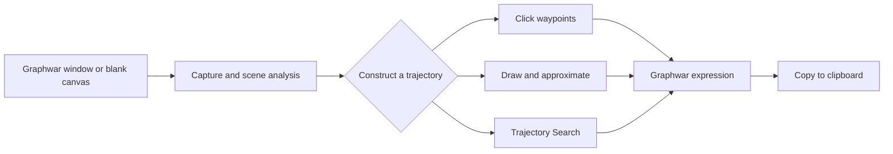
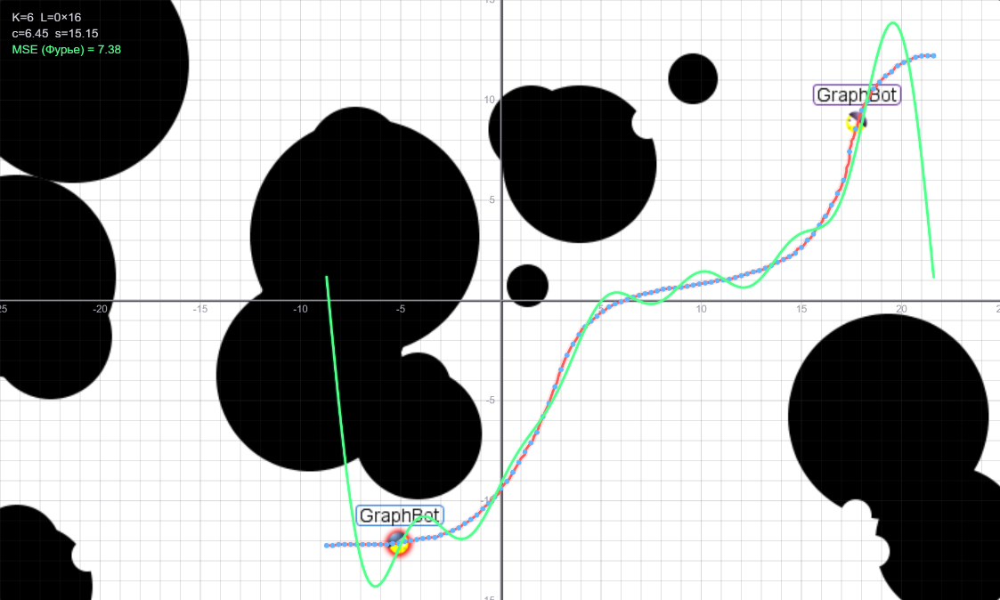
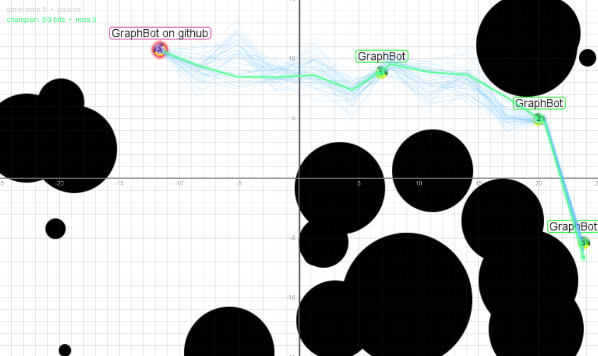

# GraphBot

> Turn a Graphwar battlefield into a mathematical trajectory.

**See it. Shape it. Evolve it. Export the equation.**

[Graphwar](https://github.com/catabriga/graphwar) is an artillery game where mathematical functions become projectile trajectories. GraphBot is a local visual laboratory for constructing those functions: click a route, draw a curve for approximation, or search for a trajectory with an evolving population—then copy a Graphwar-ready expression.

**[Browse GraphBot screenshots on Steam →](https://steamcommunity.com/id/*KroSheChKa*/screenshots/?appid=1899700&sort=score&browsefilter=myfiles&view=grid#scrollTop=200)**

<!-- Planned hero media: docs/media/hero-demo.gif. The exact storyboard and export requirements live in docs/media/README.md. Add the asset here when it is ready; intentionally no placeholder or broken image is shown. -->

## Mathematics is the weapon

GraphBot is not a macro. It turns geometry into several genuinely different mathematical representations.

$$
f(x)=b+\sum_{i=1}^{N}w_i\,\sigma\bigl(k(x-x_i)\bigr)
$$

**Sigmoid network** — a trainable sum of smooth steps.

$$
f(t)=a_0+\sum_{k=1}^{K}\left(a_k\cos(k\pi t)+b_k\sin(k\pi t)\right)
$$

**Fourier features** — a harmonic vocabulary for waves and repeated shape.

$$
\operatorname{ReLU}(z)=\max(0,z)=\frac{z+|z|}{2}
$$

**Graphwar-safe export** — ReLU can be written with `abs`, rather than `max`.

For search, a population of candidate trajectories is repeatedly scored and selected:

$$
\text{population}\ \longrightarrow\ \text{mutate + crossover}\ \longrightarrow\ \text{rank}\ \longrightarrow\ \text{champion}
$$

The short version is here; the implementation-facing explanation is in [the mathematics guide](docs/MATH.md).

## What it does

GraphBot's primary experience is a local browser UI for Windows.

| Mode | Use it when | Output |
|---|---|---|
| **Click Mode** | You know the route and want exact waypoints. | Piecewise absolute-value segments. |
| **Draw Mode** | You want to sketch a shape and compare mathematical fits. | A fitted formula from one of five families. |
| **Trajectory Search** | You have a start and targets and want the computer to search. | The current evolutionary champion. |

It captures the Graphwar client area off-screen, detects useful scene information, and never injects code, reads game memory, or submits shots. You remain in control of pasting and firing the expression.

## See → understand → construct → encode


```mermaid
flowchart LR
  A[Graphwar window or blank canvas] --> B[Capture and scene analysis]
  B --> C{Construct a trajectory}
  C --> D[Click waypoints]
  C --> E[Draw and approximate]
  C --> F[Trajectory Search]
  D --> G[Graphwar expression]
  E --> G
  F --> G
  G --> H[Copy to clipboard]
```

The field is normalized to approximately $x\in[-25,25]$, $y\in[-15,15]$. Capture can provide an active-player anchor and a raster forbidden mask from dark obstacles; the UI uses that mask during Trajectory Search.

## Click Mode

**You know where the function should go. Click the waypoints.**

The first click is the active soldier; later clicks form targets in route order. GraphBot builds the path from absolute-value segments. For endpoints $(x_1,y_1)$ and $(x_2,y_2)$:

$$
d=-\frac{y_1-y_2}{2(x_2-x_1)},\qquad
s(x)=d\left(|x-x_1|-|x-x_2|\right)
$$

This makes a compact piecewise-linear building block that Graphwar can evaluate. Click Mode's exported expression intentionally has no `y=` prefix.

## Draw Mode

**Draw a curve. Let several kinds of mathematics explain it.**

<p align="center">
  
</p>

The same sampled stroke can be represented by these implemented families:

| Family | Intuition | Good at |
|---|---|---|
| **Linear segments** | Connect the sampled points directly. | Exact control and simple routes. |
| **Sigmoid network** | Learn the weights of shifted logistic steps. | Smooth transitions and step-like shapes. |
| **Taylor features + MLP** | Feed powers of normalized position into a linear model or small network. | Smooth global trends and nonlinear feature combinations. |
| **Fourier features + MLP** | Feed sine/cosine harmonics into a linear model or small network. | Oscillation and wave-like structure. |
| **Cubic spline / B-spline** | Build locally controlled piecewise cubics. | Smooth interpolation or smoothing. |

GraphBot reports the selected model's MSE and lets you retrain the neural methods after changing their controls. Taylor is a normal implemented option—not a placeholder.

## One drawing. Five mathematical answers.

The planned comparison asset will keep one target stroke on screen while Linear, Sigmoid, Taylor, Fourier, and Spline/B-spline solutions take turns explaining it. Accuracy is only part of the point: the same geometry can be encoded by fundamentally different mathematical families.

<!-- Planned comparison media: docs/media/approximators-comparison.gif. See docs/media/README.md. -->

## Function laboratory

### Polynomial / Taylor features

$$
\phi(t)=[1,t,t^2,\ldots,t^n]
$$

**Good at:** smooth global structure. With zero hidden layers the result is a polynomial in normalized position; with hidden layers, GraphBot trains an MLP on those features.

### Fourier features

$$
\phi(t)=[1,\cos(\pi t),\sin(\pi t),\ldots,\cos(K\pi t),\sin(K\pi t)]
$$

**Good at:** periodic or oscillatory structure. Zero hidden layers yield a Fourier-like harmonic sum; hidden layers add a learned nonlinear mapping.

### Sigmoid network

$$
f(x)=b+\sum_i w_i\,\sigma(k(x-x_i))
$$

**Good at:** transitions. The UI exposes the number of steps, steepness, epochs, and learning rate.

### Cubic spline and B-spline

$$
S_i(x)=a_i+b_i(x-x_i)+c_i(x-x_i)^2+d_i(x-x_i)^3
$$

**Good at:** smooth local interpolation. The UI offers natural or clamped cubic splines, plus a cubic B-spline fit with configurable control-point density and smoothing.

Want the derivations, coordinate conventions, and export details? Read [docs/MATH.md](docs/MATH.md).

## Neural approximation, made exportable

For Taylor and Fourier models, GraphBot can train a small feature MLP:

```text
normalized x → feature vector φ(x) → hidden layers + activation → y
```

Supported hidden-layer activations are **tanh, sigmoid, ReLU, Leaky ReLU, Softplus, Swish/SiLU, GELU (approximation),** and **Mish**. The formula exporter converts the selected network to expression text; for example, it expands ReLU into an `abs` identity.

<p align="center">
  
</p>

<!-- Planned training media: docs/media/mlp-training.gif. See docs/media/README.md. -->

## Trajectory Search

**Place a start and targets. Watch candidates search for a route.**

Trajectory Search is the public name for the UI's former “Dot Mode.” It describes the user outcome and stays accurate if future solvers are not genetic algorithms. The current solver is an evolutionary algorithm.

<p align="center">
  
</p>

Each candidate stores $y$ values at fixed, increasing $x$ control points. The first point is locked to the active soldier; candidates may be rendered as straight segments or a natural cubic spline. Selection ranks trajectories lexicographically by:

1. staying inside the field;
2. avoiding the optional detected forbidden region;
3. hitting more targets;
4. reducing miss distance;
5. avoiding configured edge strips and unnecessary length.

The capture pipeline can turn dark obstacle pixels into a safety-expanded occupancy grid. It is a practical collision mask, not a claim of perfect semantic understanding of every map element. Targets left of the start are unavailable because this solver deliberately moves only right.

<!-- Planned evolutionary media: docs/media/automatic-search.gif. See docs/media/README.md. -->

## Quick start

Requirements: **Windows**, **Python 3.10+**, and a Graphwar window titled `Graphwar` if you want to capture a field.

```powershell
git clone https://github.com/KroSheChKa/GraphBot.git
cd GraphBot
python -m venv .venv
.\.venv\Scripts\Activate.ps1
pip install -r requirements.txt
python tools/approximator_server.py
```

Open [http://127.0.0.1:8765/](http://127.0.0.1:8765/) if the browser does not open automatically. Choose a mode, optionally press **Capture field**, create a trajectory, then use **Copy y**.

For setup, controls, calibration, and troubleshooting, see [the user guide](docs/USER_GUIDE.md). For Graphwar syntax and game behavior, see [GAME_RULES.md](GAME_RULES.md).

## Status

**Stable workflows**

- Local UI with Click Mode, Draw Mode, and formula copying.
- Draw approximators: linear, sigmoid, Taylor, Fourier, cubic spline, and B-spline.
- Quiet Win32 field capture, active-player detection, and forbidden-mask extraction.

**Experimental / research workflows**

- Trajectory Search's evolutionary solver and its obstacle interpretation.
- The legacy `GraphBot.py` console/OpenCV program, including A*, polynomial search, and symbolic genetic search.

`GraphBot.py` remains in the repository because it contains distinct research planners not exposed by the UI. It is deliberately not the recommended entry point.

## Documentation

- [Mathematics](docs/MATH.md) — models, neural features, search, and export.
- [User Guide](docs/USER_GUIDE.md) — operating the UI, capture, calibration, and fixes.
- [Graphwar Rules](GAME_RULES.md) — game modes and expression constraints.
- [Showcase media plan](docs/media/README.md) — stable filenames and animation storyboards.
- [Roadmap](TODO.md) — implementation work still planned.

## License

MIT. See [LICENSE](LICENSE).
